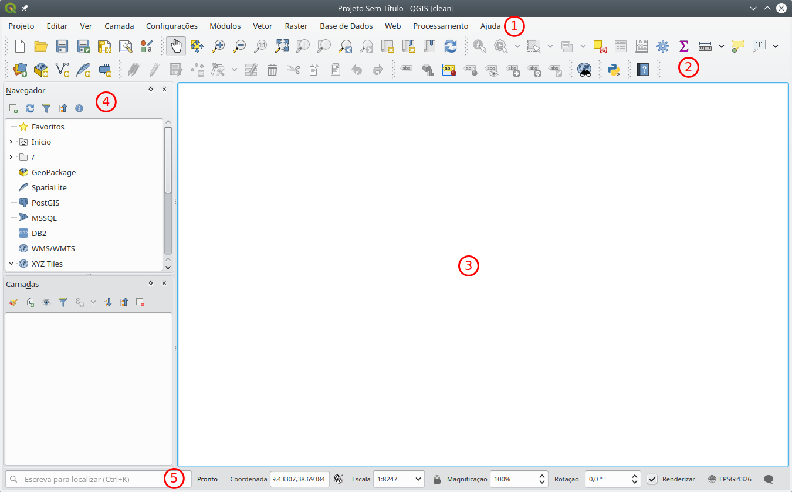

Introdução/Revisão QGIS
=======================

Interface gráfico
-----------------

   Interface gráfico do QGIS 3.4

A interface do QGIS está dividida em cinco componentes:

1. **Barra de menus** - permite acesso a praticamente todas as funcionalidades e configurações do QGIS.
2. **Barras de ferramentas** - fornece o acesso rápido a funções presentes nos menus, e ferramentas adicionais para interagir com o mapa.
3. **Vista do mapa (tela)** - também designada por vezes como **Tela** (do mapa), é a àrea principal de trabalho do QGIS. É aqui que as geometrias vectoriais e images matriciais são mostradas.
4. **Painéis** - janelas para desempenhar tarefas específicas. Os paineis de :guilabel:`Camadas` e :guilabel:`Navegador` são os principais paineis.
5. **Barra de estado** - mostra informação variada acerca da vista do mapa, como por exemplo, a escala, rotação, e extensão do mapa.

   .. note::

      No QGIS 3.4, no lado esquerdo da :guilabel:`Barra de estado` existe uma nova ferramenta chamada **Localizador**, que permite encontrar ferramentas, dados, paineis de forma rápida.

.. tip:: Ligar e desligar paineis e barras de ferramentas

   É possível ligar e desligar Paineis e Barras de ferramentas de acordo com as necessidades, usando os menus :menuselection:`Ver --> Paineis` e :menuselection:`Ver --> Barra de ferramentas`. Alternativamente, pode-se clicar com o botão direito num espaço vazio de uma barra de ferramentas, ou título de um painel.

Paineis principais
..................

* Painel das camadas
* Painel de navegação
* Painel das mensagens
* Painel de processamento

Carregar dados
--------------

Gestor de fontes de dados
.........................

Apartir do QGIS 3.0, existe uma nova ferramenta centralizada para carregar dados. Para a

Painel Navegador
................

* drag and drop
* adicionar ao map
Arrastando ficheiros do explorador de ficheiros do windows

Caso especial dos rasters de ortos

Criar piramides e criar VRTs

Controlar Camadas
Ligar e desligar Camadas
Ordenar Camadas
Criar grupos de camadas

Navegacao no mapa
-----------------

Barra de ferramentas de navegação
.................................

   Barra de navegação do mapa

* |pan| Mover a vista do mapa
* |zoomIn| Aproximar mapa
* |zoomOut| Afastar mapa
* Afastar

Usando o rato
.............

.. tip:: Aproximar à camada

Uso do rato
roda do rato zoom in e zoom out
click no meio arrastar o mapa
zoom total
undo e redo zoom

no painel de Camadas
zoom a camadas

Inspeccionar dados
------------------

identify tool
usar para ver atributos de um ou mais elementos
pode'se escolher qual o modo de pesquisa de elementos
valores dos atributos e valores derivados
se se usar sobre um raster, mostra os respectivos valores

tabela de atributos

ver atributos
ordenar atributos por colunas

Seleccao de elementos
- na tabela de atributos, ver que aparecem seleccionados no mapa. Uso do CTRL
para seleccionar varios elementos e o SHIFT para selecionar intervalos.

' na barra de ferramentas'
- usar o CTRL paa adicioar novos elementos a Seleccao usando as ferramentas do mapa
' desenhar rectangulos e outras formas para seleccionar elementos no mapa'

' Seleccao por expressao EXTRA'

Simbologia nas camadas

Propriedades de uma camadas
Right'click ou duplo click
Painel de simbologia

simbologia simples
simbologia por categorias
alterar simbolos de categorias

Rótulos

Adicionar rotulos simples de um atributo.

Truque: multi simbologia

Simbologia

Gravar um projecto

Carregar o projecto

.. Substitutions definitions - AVOID EDITING PAST THIS LINE
   This will be automatically updated by the find_set_subst.py script.
   If you need to create a new substitution manually,
   please add it also to the substitutions.txt file in the
   source folder.

.. |pan| image:: /static/common/mActionPan.png
   :width: 1.5em
.. |zoomIn| image:: /static/common/mActionZoomIn.png
   :width: 1.5em
.. |zoomOut| image:: /static/common/mActionZoomOut.png
   :width: 1.5em
